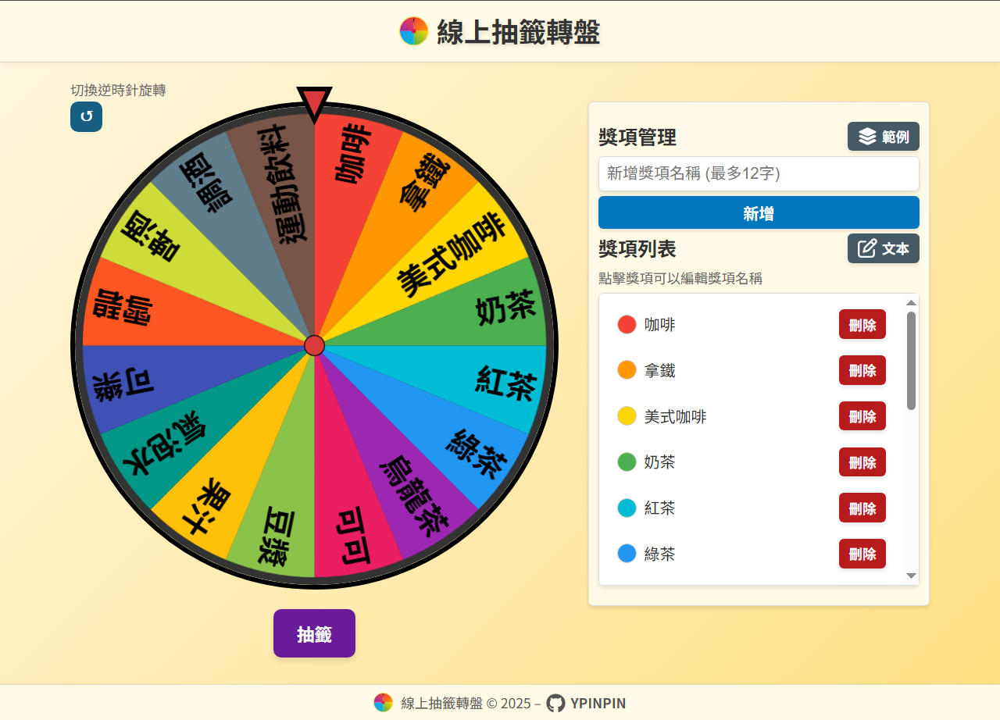

#  Vue 3 線上免費抽籤轉盤工具

[](https://vuejs.org/)
[](https://vitejs.dev/)
[](https://sass-lang.com/dart-sass)
[](https://eslint.org/)
[](https://ypinpin.github.io/online-lucky-wheel/)
[](https://github.com/YPINPIN/online-lucky-wheel/commits/main)

一個基於 **Vue 3 + Vite** 的互動式線上**幸運抽籤轉盤**，支援自訂獎項、多種範本，適合用於抽獎活動、派對遊戲或任何需要隨機抽籤的場合。

[💻 **線上 Demo**](https://ypinpin.github.io/online-lucky-wheel/)



---

## 🎮 使用方法

### 基本操作

1. **新增獎項**
   - 在「新增獎項名稱」輸入框輸入獎項名稱，點擊「新增」按鈕。
2. **編輯獎項**
   - 點擊獎項列表中的名稱即可編輯，完成後按「保存」。
3. **刪除獎項**
   - 點擊獎項右側的「刪除」按鈕刪除。
4. **開始抽籤**
   - 點擊「抽籤」按鈕開始旋轉轉盤。

### 進階功能

- **批量編輯**
  - 點擊「文本」按鈕切換至「文本模式」，可一次新增、編輯、刪除多個獎項。
- **預設範本**
  - 點擊「範例」按鈕，可載入內建範例獎項。

---


---

## ✨ 專案特色

### 🎡 轉盤抽籤功能

- **動態繪製**
  - 使用 HTML5 Canvas 根據獎項即時渲染。
- **動畫展示**
  - 抽籤旋轉動畫，結束後顯示中獎彈窗並高亮顯示區塊。

### 🏆 獎項管理

- 支援**列表模式**與**文本模式**。
- 項目可即時編輯、刪除並自動更新畫面。
- 提供**50 種預設顏色**，超出自動生成不重複隨機色。
- 自動儲存至 `localStorage`，重整不會遺失。

### 🎶 音效系統

- **旋轉音效**：每經過一個獎項時播放。
- **中獎音效**：結束時播放提示音。

### 📱 響應式設計

- 支援桌機與行動裝置。
- 轉盤旋轉期間鎖定所有操作按鈕避免誤觸。

### 🔎 SEO

- 基本 `meta tags`。
- **預渲染**（[vite-prerender-plugin](https://github.com/preactjs/vite-prerender-plugin)）強化 SEO。

---

## 🛠️ 開發與安裝

1. **下載專案**

   ```bash
   git clone https://github.com/YPINPIN/online-lucky-wheel.git
   cd online-lucky-wheel
   ```

2. **安裝依賴**

   ```bash
   npm install
   ```

3. **啟動開發伺服器**

   ```bash
   npm run dev
   ```

4. **打包建置**

   ```bash
   npm run build
   ```

---

### 📦 專案結構

```text
online-lucky-wheel/
├── public/                   # 公用靜態資源 (favicon、logo)
│   └── index.html            # HTML 模板
├── src/
│   ├── assets/               # 靜態資源 (音效、json)
│   ├── components/           # Vue 組件
│   │   ├── icons/            # 自定義 SVG 圖示
│   │   ├── AppHeader.vue     # 頁首
│   │   ├── AppFooter.vue     # 頁尾
│   │   ├── LuckyWheel.vue    # 轉盤組件
│   │   ├── PrizeManager.vue  # 獎項管理組件
│   │   └── PrizeModal.vue    # 提示 modal
│   ├── styles/               # 全域樣式
│   │   ├── _mixins.scss
│   │   ├── _variables.scss
│   │   └── _reset.scss       # css reset
│   ├── utils/                # 工具方法
│   │   └── colors.js         # 顏色
│   ├── prerender.js          # 預渲染腳本
│   ├── App.vue               # 主應用組件
│   └── main.js               # 入口文件
├── .gitignore                # Git 忽略規則
├── package.json              # 專案依賴
├── vite.config.js            # Vite 設定
└── README.md                 # 專案說明文件
```

---

### ⚙ 音效及圖示來源

- **音效 (mixkit)**
  - [Modern technology select](https://mixkit.co/free-sound-effects/click/)
  - [Achievement bell](https://mixkit.co/free-sound-effects/discover/achievement/)
- **圖示 (FontAwesome)**
  - [Layer Group](https://fontawesome.com/icons/layer-group?f=classic&s=solid)
  - [Rectangle List](https://fontawesome.com/icons/rectangle-list?f=classic&s=regular)
  - [Pen To Square](https://fontawesome.com/icons/pen-to-square?f=classic&s=regular)
  - [GitHub](https://fontawesome.com/icons/github?f=classic&s=brands)
